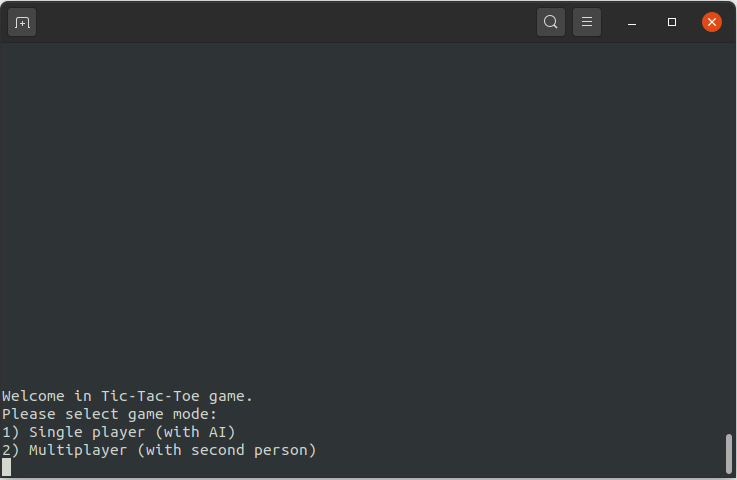
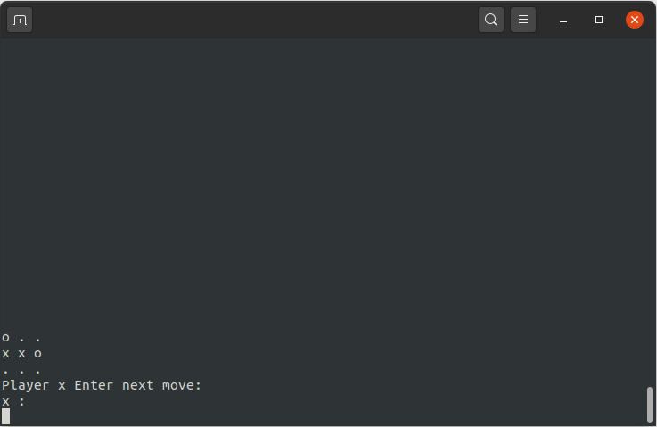
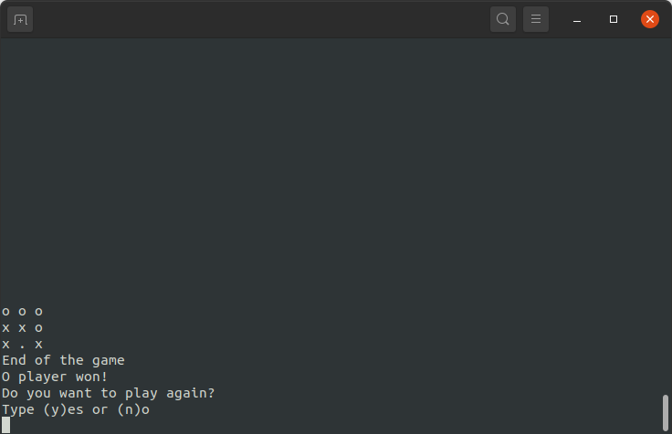

# Tic-Tac-Toe

## Authors:

- marcindus - https://github.com/marcindus
- mateusz-talma - https://github.com/mateusz-talma

## Screenshots:




## Description:
This is a simple version of Tic-Tac-Toe. The game has two modes:
- Singleplayer - you can play with AI,
- Multiplayer - you can play with second person.

This is a console game - interact with the user by printing to the console and typing on the keyboard.

We used C++, CMake and gtest

## How to run:
1. Clone repository to your computer.
2. Create build directory inside: ```mkdir build```
3. Go to build: ```cd build```
4. Create cmake files ```cmake ..```
5. Build ```make```
6. Run ```./tictactoe```

## To do list:
1. Create new test cases.
2. Implement some GUI framework.
3. Implement the third mode - playing over the network.
4. Implement the ability to choose the size of the board.
